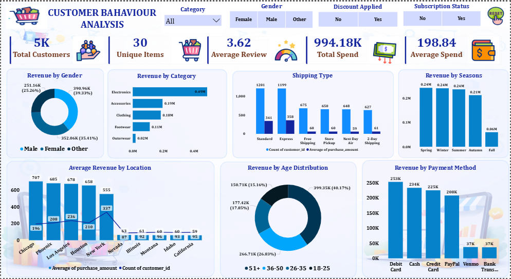

# 📊 Customer Behaviour Analysis Dashboard

## 📌 Overview

This project presents an interactive **Customer Behaviour Analysis Dashboard** built to analyze customer purchasing patterns, spending habits, and preferences. The dashboard provides key insights that help businesses make data-driven decisions.

---

## 🚀 Features

* 📈 **Total Customers**: 5K
* 🛍️ **Unique Items**: 30
* ⭐ **Average Review Rating**: 3.62
* 💰 **Total Spend**: 994.18K
* 💳 **Average Spend per Customer**: 198.84

---

## 📊 Dashboard Insights

### 1. Revenue by Gender

* Male customers contribute the highest revenue (~39%)
* Female and other categories follow closely

### 2. Revenue by Category

* Electronics generates the highest revenue (~0.49M)
* Followed by Accessories, Clothing, and Footwear

### 3. Shipping Type Analysis

* Standard and Express shipping are most preferred
* Free shipping has moderate usage
* Faster options like Next Day and 2-Day are less used

### 4. Seasonal Revenue Trends

* Spring, Winter, and Summer show consistent high revenue
* Fall shows a noticeable drop

### 5. Location-wise Revenue

* Cities like Chicago, Phoenix, and Los Angeles perform well
* Some locations have lower customer count but higher average spend

### 6. Age Distribution

* Age group **51+** contributes the highest revenue (~40%)
* Followed by 36–50 and 26–35 segments

### 7. Payment Methods

* Debit Card is the most used payment method
* Followed by Cash, Credit Card, and PayPal
* Venmo and Bank Transfer are least used

---

## 🛠️ Tools & Technologies

* Power BI (for dashboard creation)
* Data Visualization techniques
* Data Cleaning & Transformation

## 📸 Dashboard Preview

